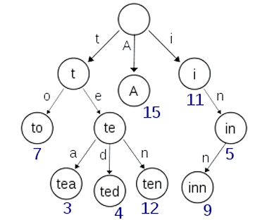

# Chapter 4 - Generics


Starting with version 5.0, Java allows defining classes and methods that include parameters for types. Such definitions are
called generics.
Introducing parameterized types enables creating classes, methods, and interfaces independent of specific data types.
This means that a single class, method, or interface can be used with multiple data types without requiring a concrete, specific
implementation. If `Object` is the superclass of all other classes whose reference can point to any object type, such
a way still cannot ensure type safety. With the introduction of parameterized types, we can successfully prevent errors
that occur as a result of casting during program execution.


## **4.1 Generic Classes, Interfaces, and Methods**

### **4.1.1 Generic Classes**

A class defined with a parameter as a type is called a generic class or a parameterized class. A parameterized type is given inside angle brackets after the class name in its header. Any meaningful word may be used as an identifier for the type parameter. By convention, the parameter starts with a capital letter. A parameterized type can be used like any other type in the class definition.

> ### Problem 4.1
> Implement a generic class **Triple** of numeric values (which are subclasses of `Number`).
> The class should implement:
>
> * a constructor with 3 (three) arguments,
> * `double max()` – returns the largest of the three numbers
> * `double average()` – returns the average of the three numbers
> * `void sort()` – sorts the elements in ascending order
> * override the method `toString()` so that it returns a formatted string with two decimal places for each element and a space between them.


In this task, it is necessary to store three instance variables in the class **Triple**, and all three must be of the same type. The type of these variables must be a subtype of the class **Number**.
By using generics, these three variables are defined with the generic type **T**.
In the class definition, we add **`<T extends Number>`**, which indicates that **T** must be a type that inherits from the class **Number**.
With this, the class `Triple` can be used for triples of the types **Short**, **Integer**, **Float**, **Double**, **Long**, etc.


```java
import java.util.Scanner;

class Triple<T extends Number> {
    T first, second, third;

    public Triple(T first, T second, T third) {
        this.first = first;
        this.second = second;
        this.third = third;
    }

    public double max() {
        double max = first.doubleValue();
        if (second.doubleValue() > max) {
            max = second.doubleValue();
        }
        if (third.doubleValue() > max) {
            max = third.doubleValue();
        }
        return max;
    }

    public double average() {
        double sum = first.doubleValue()
                + second.doubleValue()
                + third.doubleValue();
        return sum / 3;
    }

    public void sort() {
        if (first.doubleValue() > second.doubleValue()) {
            T temp = second;
            second = first;
            first = temp;
        }
        if (second.doubleValue() > third.doubleValue()) {
            T temp = third;
            third = second;
            second = temp;
        }
        if (first.doubleValue() > second.doubleValue()) {
            T temp = second;
            second = first;
            first = temp;
        }
    }

    @Override
    public String toString() {
        return String.format("%.2f %.2f %.2f",
                first.doubleValue(),
                second.doubleValue(),
                third.doubleValue());
    }

    public static void main(String[] args) {
        Scanner scanner = new Scanner(System.in);

        // Integers
        int a = scanner.nextInt();
        int b = scanner.nextInt();
        int c = scanner.nextInt();

        Triple<Integer> tInt = new Triple<>(a, b, c);

        System.out.printf("%.2f\n", tInt.max());
        System.out.printf("%.2f\n", tInt.average());

        tInt.sort();
        System.out.println(tInt);

        // Floats
        float fa = scanner.nextFloat();
        float fb = scanner.nextFloat();
        float fc = scanner.nextFloat();

        Triple<Float> tFloat = new Triple<>(fa, fb, fc);

        System.out.printf("%.2f\n", tFloat.max());
        System.out.printf("%.2f\n", tFloat.average());

        tFloat.sort();
        System.out.println(tFloat);

        // Doubles
        double da = scanner.nextDouble();
        double db = scanner.nextDouble();
        double dc = scanner.nextDouble();

        Triple<Double> tDouble = new Triple<>(da, db, dc);

        System.out.printf("%.2f\n", tDouble.max());
        System.out.printf("%.2f\n", tDouble.average());

        tDouble.sort();
        System.out.println(tDouble);
    }
}
```


> ### Problem 4.2
> Implement a class for a generic table **`GenericTable`** with generic row keys that are comparable (`Comparable`) and generic values that must be subclasses of `Number`.
>
> The class should implement the following methods:
> • `void addRow(RowKey key, Value... values)` – adds an array of values to the row identified by the given key
> • `double max(RowKey key)` – returns the (double) value of the maximum element in the row with the given key
> • `String toString()` – returns a `String` representation of the table in the format for each row:
> `key: v1 v2 … vn`
> where each value **v** is printed with 6 (six) positions, of which two are decimal places, and separated by a tab `\t`


The specification given for the method `addRow(RowKey rowKey, Value... values)`
shows that, to solve this task, two generic parameters `RowKey` and `Value` will be needed.
Additionally, we can see that the keys of the rows must be comparable objects, meaning that the generic type `RowKey`
must extend (i.e., implement) the `Comparable` interface (`RowKey extends Comparable`).
The values must be numeric types, i.e., the classes that will be used instead of the generic type 
`Value` must be subclasses of the class `Number` (`Value extends Number`).

In accordance with this, the definition of the generic class `GenericTable` will be

`class GenericTable<RowKey extends Comparable, Value extends Number>`.
The definition of this class can also be
`class GenericTable<RowKey extends Comparable<RowKey>, Value extends Number>`.
Practically, this means that instead of implementing the method
`compareTo(Object obj)`
it will be necessary to implement the method
`compareTo(RowKey rowKey)`.

If the constraints on the types `RowKey` and `Value` are not imposed, then it will be impossible for the generic table to be represented using a `TreeMap`, because the elements of the class `RowKey` would not be able to be compared with each other.
Also, the method
`double max(RowKey key)`
would be impossible to implement for the same reasons (the class `Number` implements the interface `Comparable<Number>` and objects of that class can be compared with each other).

```java
import java.util.*;

class Key implements Comparable<Key> {
    int index;
    String name;

    public Key(int index, String name) {
        this.index = index;
        this.name = name;
    }

    @Override
    public int compareTo(Key o) {
        return Integer.compare(index, o.index);
    }

    @Override
    public String toString() {
        return String.format("%d (%s)", index, name);
    }
}

class GenericTable<RowKey extends Comparable<RowKey>, Value extends Number> {
    Map<RowKey, List<Value>> rows;

    public GenericTable() {
        rows = new TreeMap<>();
    }

    public void addRow(RowKey key, Value... values) {
        List<Value> row = rows.get(key);
        if (row == null) {
            row = new ArrayList<>();
        }
        row.addAll(Arrays.asList(values));
        rows.put(key, row);
    }

    public double max(RowKey key) {
        List<Value> row = rows.get(key);
        double max = Double.MIN_VALUE;
        for (Number number : row) {
            max = Math.max(max, number.doubleValue());
        }
        return max;
    }

    @Override
    public String toString() {
        StringBuilder res = new StringBuilder();
        for (RowKey key : rows.keySet()) {
            List<Value> row = rows.get(key);
            res.append(String.format("%s: ", key));
            for (Value value : row) {
                res.append(String.format("%6.2f\t", value.doubleValue()));
            }
            res.append('\n');
        }
        return res.toString();
    }

    public static void main(String[] args) {
        Scanner scanner = new Scanner(System.in);

        GenericTable<String, Integer> stringTable = new GenericTable<>();
        GenericTable<Integer, Double> integerTable = new GenericTable<>();
        GenericTable<Key, Float> keyTable = new GenericTable<>();

        int n = scanner.nextInt();
        scanner.nextLine();

        for (int i = 0; i < n; ++i) {
            String[] parts = scanner.nextLine().split("\\s+");
            Integer[] values = new Integer[parts.length - 1];
            for (int j = 0; j < values.length; ++j) {
                values[j] = Integer.parseInt(parts[j + 1]);
            }
            stringTable.addRow(parts[0], values);
        }

        System.out.println("=== STRING TABLE ===");
        System.out.println(stringTable);
        String k = String.format("row%d", n / 2);
        System.out.printf("MAX (%s): %.2f\n", k, stringTable.max(k));

        n = scanner.nextInt();
        scanner.nextLine();

        for (int i = 0; i < n; ++i) {
            String[] parts = scanner.nextLine().split("\\s+");
            Double[] values = new Double[parts.length - 1];
            for (int j = 0; j < values.length; ++j) {
                values[j] = Double.parseDouble(parts[j + 1]);
            }
            integerTable.addRow(Integer.parseInt(parts[0]), values);
        }

        System.out.println("=== INTEGER TABLE ===");
        System.out.println(integerTable);
        System.out.printf("MAX (%d): %.2f\n", n / 2, integerTable.max(n / 2));

        n = scanner.nextInt();
        scanner.nextLine();

        for (int i = 0; i < n; ++i) {
            String[] parts = scanner.nextLine().split("\\s+");
            Float[] values = new Float[parts.length - 1];
            for (int j = 0; j < values.length; ++j) {
                values[j] = Float.parseFloat(parts[j + 1]);
            }
            String[] keys = parts[0].split(":");
            Key key = new Key(Integer.parseInt(keys[0]), keys[1]);
            keyTable.addRow(key, values);
        }

        System.out.println("=== KEY TABLE ===");
        System.out.println(keyTable);
        Key key = new Key(1, "a");
        System.out.printf("MAX (%s): %.2f\n", key, keyTable.max(key));

        scanner.close();
    }
}
```


> ### Problem 4.3
> Implement `GenericCounter<T>` for counting identical elements.
> The class should implement two methods:
> • `void count(T element)` – a method that receives an element to be counted
> • `String toString()` – returns a string representation of the counted elements in the form
>
> ```
>  [element][* repeated as many times as that element was counted]
> ```
>
> The solution must have memory complexity **O(n)** and time complexity **O(n)** for counting the elements (linear search).


In this task, the class `GenericCounter` is defined with the generic parameter `T`.
Additionally, an auxiliary generic class `CountableElement<T>` is created, which contains an element of type `T` and a counter for the number of occurrences of that element.

When counting the elements in the method `void count(T element)`, if a new element appears, it is added to a list of objects of type `CountableElement<T>`.
If the element has appeared previously, the counter for its occurrences is increased by one.


```java
import java.util.ArrayList;
import java.util.List;
import java.util.Scanner;

class GenericCounter<T> {
    List<CountableElement<T>> elements;

    GenericCounter() {
        elements = new ArrayList<>();
    }

    public void count(T element) {
        for (int i = 0; i < elements.size(); ++i) {
            CountableElement<T> el = elements.get(i);
            if (el.isEqual(element)) {
                el.increment();
                return;
            }
        }
        elements.add(new CountableElement<>(element));
    }

    @Override
    public String toString() {
        StringBuilder sb = new StringBuilder();
        for (CountableElement<T> el : elements) {
            sb.append(String.format("%s|%s\n",
                    el.element.toString(),
                    countToStar(el.count)));
        }
        return sb.toString();
    }

    static String countToStar(int c) {
        StringBuilder sb = new StringBuilder();
        for (int i = 0; i < c; ++i) {
            sb.append("*");
        }
        return sb.toString();
    }
}

class CountableElement<T> {
    int count;
    T element;

    public CountableElement(T element) {
        this.element = element;
        this.count = 1;
    }

    public void increment() {
        ++count;
    }

    public boolean isEqual(T element) {
        return this.element.equals(element);
    }
}

public class GenericCounterTest {
    public static void main(String[] args) {
        Scanner scanner = new Scanner(System.in);

        int n = scanner.nextInt();
        GenericCounter<Integer> counterInt = new GenericCounter<>();
        for (int i = 0; i < n; ++i) {
            int x = scanner.nextInt();
            counterInt.count(x);
        }
        System.out.println("=====INTEGERS=====");
        System.out.println(counterInt);

        n = scanner.nextInt();
        scanner.nextLine();
        GenericCounter<String> counterString = new GenericCounter<>();
        for (int i = 0; i < n; i++) {
            String s = scanner.nextLine();
            counterString.count(s);
        }
        System.out.println("=====STRINGS=====");
        System.out.println(counterString);

        n = scanner.nextInt();
        GenericCounter<Float> counterFloat = new GenericCounter<>();
        for (int i = 0; i < n; i++) {
            float f = scanner.nextFloat();
            counterFloat.count(f);
        }
        System.out.println("=====FLOATS=====");
        System.out.println(counterFloat);

        scanner.close();
    }
}
```

> ### Problem 4.4
> Develop a generic class `GenericFraction` for working with fractions.
> The class has two generic parameters `T` and `U`, which must both be some class that extends `Number`.
> `GenericFraction` has two fields:
> • `numerator` – the numerator
> • `denominator` – the denominator
>
> The class should implement the following methods:
> • `GenericFraction(T numerator, U denominator)` – a constructor that initializes the numerator and denominator of the fraction. If an attempt is made to assign the fraction a value of 0 for the denominator, an exception of type `ZeroDenominatorException` should be thrown.
>
> • `GenericFraction<Double, Double> add(GenericFraction<? extends Number, ? extends Number> gf)` – adds two fractions
>
> • `double toDouble()` – returns the value of the fraction as a real (`double`) number
>
> • `String toString()` – prints the fraction in the following format:
>
> ```
> **[numerator] / [denominator]**, shortened (normalized) and always with two decimal places.
> ```

In accordance with the task description, the generic class for fractions must have two generic parameters that inherit from the class `Number`.
This requirement is defined in such a way that the numerator and denominator of the fraction can be represented with different levels of precision (e.g., a numerator of type `Short` and a denominator of type `Double`).

Even though the numerator and denominator may be represented with different numeric precision, inheritance from the class `Number` guarantees that their values can be converted to `Double` using the method `doubleValue()`.
This enables the implementation of the methods `toDouble()` and `gcd()`.

The use of the wildcard symbol (`?`) in the method
`add(GenericFraction<? extends Number, ? extends Number> gf)`
means that the corresponding data type may be any class that extends the class `Number`.
This allows summing two fractions whose numerator and denominator are instances of different classes of this type (for example, a fraction whose numerator is of type `Short` and denominator is of type `Long`, and another fraction whose numerator is `Long` and denominator is `Integer`).

If generic type parameters `T` and `U` were used directly instead of wildcard symbols, then the `add` method could only sum fractions whose numerator and denominator are of the same corresponding types.

```java
import java.util.Scanner;

class GenericFraction<T extends Number, U extends Number> {
    private T numerator;
    private U denominator;

    public GenericFraction(T numerator, U denominator)
            throws ZeroDenominatorException {
        if (denominator.doubleValue() == 0) {
            throw new ZeroDenominatorException();
        }
        this.numerator = numerator;
        this.denominator = denominator;
    }

    double toDouble() {
        return this.numerator.doubleValue() /
               this.denominator.doubleValue();
    }

    static double gcd(double a, double b) {
        if (b == 0)
            return a;
        if (a < b)
            return gcd(a, b - a);
        else
            return gcd(b, a - b);
    }

    public double gcd() {
        return gcd(this.numerator.doubleValue(),
                   this.denominator.doubleValue());
    }

    public GenericFraction<Double, Double> add(
            GenericFraction<? extends Number, ? extends Number> gf)
            throws ZeroDenominatorException {

        return new GenericFraction<>(
                this.numerator.doubleValue() * gf.denominator.doubleValue() +
                this.denominator.doubleValue() * gf.numerator.doubleValue(),
                this.denominator.doubleValue() * gf.denominator.doubleValue()
        );
    }

    @Override
    public String toString() {
        double gcd = this.gcd();
        return String.format("%.2f / %.2f",
                this.numerator.doubleValue() / gcd,
                this.denominator.doubleValue() / gcd);
    }
}

class ZeroDenominatorException extends Exception {
    public ZeroDenominatorException() {
        super("Denominator cannot be zero");
    }
}

public class GenericFractionTest {
    public static void main(String[] args) {
        Scanner scanner = new Scanner(System.in);

        double n1 = scanner.nextDouble();
        double d1 = scanner.nextDouble();
        float n2 = scanner.nextFloat();
        float d2 = scanner.nextFloat();
        int n3 = scanner.nextInt();
        int d3 = scanner.nextInt();

        try {
            GenericFraction<Double, Double> gfDouble =
                    new GenericFraction<>(n1, d1);
            GenericFraction<Float, Float> gfFloat =
                    new GenericFraction<>(n2, d2);
            GenericFraction<Integer, Integer> gfInt =
                    new GenericFraction<>(n3, d3);

            System.out.printf("%.2f\n", gfDouble.toDouble());
            System.out.println(gfDouble.add(gfFloat));
            System.out.println(gfInt.add(gfFloat));
            System.out.println(gfDouble.add(gfInt));

            // this should trigger exception
            gfInt = new GenericFraction<>(n3, 0);

        } catch (ZeroDenominatorException e) {
            System.out.println(e.getMessage());
        }

        scanner.close();
    }
}
```


### 4.1.2 Generic methods and interfaces

Interfaces can have one or more type parameters.
The details and notation are the same as in classes with type parameters.
A type parameter can also be used in the methods of a generic class.
Additionally, a generic method can have its own type parameters, different from those of the class.
A generic method can be a regular method or a static method of a generic class and can have its own parameter type.
The type parameter of a generic method is local and applies only to the method itself, not to the class.


> ### Problem 4.5
> Implement a static generic method for printing an array of elements
> `static <E> void printArray(E[] inputArray)`.
> The method should support printing arrays of different data types.


When working with generic functions, all declared generic types in the function arguments and in the return type of the generic function must be specified before the return type of the function, inside `< >`.

In this task, only one generic type (`E`) is used, and it is the same in the argument of the function (before `void`, only `<E>` is declared).

```java
public class PrintArray {

    public static <E> void printArray(E[] inputArray) {
        for (E element : inputArray) {
            System.out.printf("%s ", element);
        }
        System.out.println();
    }

    public static void main(String[] args) {
        Integer[] intArray = { 1, 2, 3, 4, 5 };
        Double[] doubleArray = { 1.1, 2.2, 3.3, 4.4 };
        Character[] charArray = { 'H', 'E', 'L', 'L', 'O' };

        System.out.println("Array integerArray contains:");
        printArray(intArray);

        System.out.println("\nArray doubleArray contains:");
        printArray(doubleArray);

        System.out.println("\nArray characterArray contains:");
        printArray(charArray);
    }
}

```


> ### Problem 4.6
> If the previous task for the generic fraction had an additional requirement saying:
> *"Write a static generic function `create` that has two arguments (numerator and denominator), objects that are of classes extending `Number`, and returns an object of the generic fraction type"*
> then the signature and implementation of that function would be:

```java
static <T extends Number, U extends Number>
GenericFraction<T, U> create(T numerator, U denominator)
        throws ZeroDenominatorException {
    return new GenericFraction<>(numerator, denominator);
}
```


> ### Problem 4.7
> Implement a static generic method for finding the maximum of three elements:
> `static <T extends Comparable<T>> T maximum(T x, T y, T z).`
>
> The method should support comparing elements of different data types.


In this function, we have three arguments, all of generic type `T`.
That is why in the declaration of generic parameters at the beginning of the function, only the generic parameter `T` is present.

The purpose of this function is to find the maximum of the three elements.
To be able to find the maximum, the generic type `T` must be comparable.
For that reason, the type parameter is declared as
`<T extends Comparable<T>>`
in the method definition.

```java
public class Max {

    public static <T extends Comparable<T>> T maximum(T x, T y, T z) {
        T max = x;

        if (y.compareTo(max) > 0) {
            max = y;
        }

        if (z.compareTo(max) > 0) {
            max = z;
        }

        return max;
    }

    public static void main(String[] args) {
        System.out.printf("Max of %d, %d and %d is %d\n\n",
                3, 4, 5, maximum(3, 4, 5));

        System.out.printf("Max of %.1f, %.1f and %.1f is %.1f\n\n",
                6.6, 8.8, 7.7, maximum(6.6, 8.8, 7.7));

        System.out.printf("Max of %s, %s and %s is %s\n",
                "pear", "apple", "orange",
                maximum("pear", "apple", "orange"));
    }
}

```

## 4.2 Generic Data Structures

### 4.2.1 Collections in Java (lists and sets)


Java collections are classes that organize and store objects and that implement the `Collection` interface.
For example, `ArrayList<T>` is a Java collection class and it implements all methods from the `Collection` interface.
The `Collection` interface is the highest-level interface in the Java collections framework (collection classes).
All collection classes are located in the package `java.util`.


> ### Problem 4.8
> Implement a class `BodyForm` which, from an input stream (standard input, file, etc.), will read measurement data about the weights of several people.
> The data for each person and their weights (each person may have a different number of measurements) is given in the following format:
>
> ```
> name weight1 weight2 weight3...
> ```
>
> **Example:**
>
> ```
> James 81.3 90.8 87.9
> ```
>
> Your task is to implement the following methods:
>
> • `BodyForm()` – default constructor
> • `void readData(InputStream inputStream)` – method for reading the input data
> • `void printByWeight(OutputStream outputStream, int type)` – method that prints all people sorted by weight in ascending order.
> If the argument `type` has the value:
> – **1** → sort by the maximum measured weight
> – **2** → sort by the average measured weight (the average of all recorded weights)
>
> Printing a person must be in the following format:
>
> ```
> [name] MAX : [max.0] kg, AVG : [avg.0] kg
> ```


In this task, within the class `BodyForm`, you need to create a collection of the measurements for each individual person (objects of class `Person`).
Since there are no requirements for grouping people, the simplest way to store them in a collection that allows flexible manipulation is to use a generic data structure — a list (`List<Person>`).

A concrete implementation of this generic data structure that will be used in the solution is the class `ArrayList<Person>`.

When reading the data for the individuals (each person's information is given on a separate line), an object of the class `Person` is created and added to the list of objects of type `Person`.

In the method `printByWeight`, it is necessary to enable sorting of the elements in the list by two different criteria.
If sorting by only one criterion is required, this is usually done through the implementation of the generic interface `Comparable<Person>`.
When sorting by more than one criterion is required, the best approach is to implement comparators (implementation of the generic interface `Comparator<Person>`), which would be used when calling the method `Collections.sort()`.
In this task, it is necessary to implement two comparators:
• `MaxComparator` (sorting by maximum measured weight)
• `AvgComparator` (sorting by average measured weight)

Since `Comparator` is a functional interface, it can be implemented using a lambda expression.
As with any other interface, it can also be implemented using anonymous classes.

```java
import java.io.*;
import java.util.*;

class BodyForm {
    private List<Person> persons;

    public BodyForm() {
        persons = new ArrayList<>();
    }

    void readData(InputStream inputStream) {
        Scanner scanner = new Scanner(inputStream);
        while (scanner.hasNext()) {
            String line = scanner.nextLine();
            String[] parts = line.split(" ");
            String name = parts[0];
            Person person = new Person(name);
            for (int i = 1; i < parts.length; ++i) {
                person.addMeasurement(Float.parseFloat(parts[i]));
            }
            persons.add(person);
        }
        scanner.close();
    }

    void printByWeight(OutputStream outputStream, int type) {
        PrintWriter pw = new PrintWriter(outputStream);
        Collections.sort(persons, (type == 1) ?
                new MaxComparator() : new AvgComparator());

        for (Person person : persons) {
            pw.println(person);
        }
        pw.flush();
    }
}

class Person {
    String name;
    List<Float> measurements;
    float max;
    float sum;
    float avg;

    public Person(String name) {
        this.name = name;
        measurements = new ArrayList<>();
        sum = 0;
        max = Float.MIN_VALUE;
    }

    public void addMeasurement(float weightMeasurement) {
        measurements.add(weightMeasurement);
        sum += weightMeasurement;
        if (weightMeasurement > max) {
            max = weightMeasurement;
        }
        avg = sum / measurements.size();
    }

    @Override
    public String toString() {
        return String.format("%s MAX : %.1f kg, AVG : %.1f kg",
                name, max, avg);
    }
}

class MaxComparator implements Comparator<Person> {
    @Override
    public int compare(Person p1, Person p2) {
        return Float.compare(p1.max, p2.max);
    }
}

class AvgComparator implements Comparator<Person> {
    @Override
    public int compare(Person p1, Person p2) {
        return Float.compare(p1.avg, p2.avg);
    }
}

public class BodyFormTest {
    public static void main(String[] args) {
        BodyForm bodyForm = new BodyForm();
        bodyForm.readData(System.in);
        System.out.println("BY MAX");
        bodyForm.printByWeight(System.out, 1);
        System.out.println("BY AVG");
        bodyForm.printByWeight(System.out, 2);
    }
}
```

> ### Problem 4.9
> Implement a class `ArchiveStore` that keeps a list of archives (items to be archived).
> Each element for archiving – `Archive` – has:
> - `id` – id number
> - `dateArchived` – date when it was archived.
>
> There are two kinds of elements for archiving:
> - `LockedArchive`, which additionally stores the date before which it must **not** be opened – `dateToOpen`, and
> - `SpecialArchive`, which stores the maximum number of allowed openings – `maxOpen`.
>
> For the archive elements you should provide the following methods:
> - `LockedArchive(int id, LocalDate dateToOpen)` – constructor for a locked archive
> - `SpecialArchive(int id, int maxOpen)` – constructor for a special archive
>
> For the class `ArchiveStore` you should provide the following methods:
> - `ArchiveStore()` – default constructor
> - `void archiveItem(Archive item, LocalDate date)` – method that archives an item on a given date
> - `void openItem(int id, LocalDate date)` – method that opens an element from the archive with the given `id` on a given date. If there is no element with that `id`, an exception of type `NonExistingItemException` should be thrown with the message
    > `Item with id [id] doesn’t exist.`
> - `String getLog()` – returns a string with all messages recorded when archiving and opening the archives, each on a separate line.
>
> For every archiving action the following message should be added to the log text:
> `Item [id] archived at [date]`,
> while for every action of opening an archive the message
> `Item [id] opened at [date]`
> should be added.
>
> When opening a `LockedArchive` and the opening date is **before** the allowed date, the message
> `Item [id] cannot be opened before [date].`
> should be added.
>
> When opening a `SpecialArchive` and we try to open it **more times** than the allowed number `maxOpen`, the message
> `Item [id] cannot be opened more than [maxOpen] times.`
> should be added.

In the solution for this task it is necessary to use the concepts of inheritance and polymorphism. First, you should define an abstract class `Archive` with an abstract method `void open(Date date)`. From this class the two types of archives should be derived: `LockedArchive` and `SpecialArchive`. In both classes, according to the requirements of the task, the method `open()` should be overridden.
Similarly to the previous task, the archive items (objects of class `Archive`) should be stored in a generic data structure – `ArrayList<Archive>` – inside the class `ArchiveStore`.

```java
import java.time.LocalDate;
import java.util.ArrayList;
import java.util.Scanner;

class ArchiveStore {
    private ArrayList<Archive> items;
    private StringBuilder log;

    public ArchiveStore() {
        items = new ArrayList<>();
        log = new StringBuilder();
    }

    public void archiveItem(Archive item, LocalDate date) {
        item.archive(date);
        items.add(item);
        log.append(String.format("Item %d archived at %s%n",
                item.getId(), date.toString()));
    }

    public Archive openItem(int id, LocalDate date) throws NonExistingItemException {
        for (Archive item : items) {
            if (item.getId() == id) {
                try {
                    item.open(date);
                } catch (InvalidArchiveOpenException e) {
                    log.append(e.getMessage());
                    log.append("\n");
                    return item;
                }
                log.append(String.format("Item %d opened at %s%n",
                        item.getId(), date));
                return item;
            }
        }
        throw new NonExistingItemException(id);
    }

    public String getLog() {
        return log.toString();
    }
}

class NonExistingItemException extends Exception {
    public NonExistingItemException(int id) {
        super(String.format("Item with id %d doesn't exist", id));
    }
}

abstract class Archive {
    protected int id;
    protected LocalDate dateArchived;

    public void archive(LocalDate date) {
        this.dateArchived = date;
    }

    public abstract LocalDate open(LocalDate date) throws InvalidArchiveOpenException;

    public int getId() {
        return id;
    }

    @Override
    public boolean equals(Object obj) {
        if (!(obj instanceof Archive)) return false;
        Archive archive = (Archive) obj;
        return this.id == archive.id;
    }
}

class LockedArchive extends Archive {
    private LocalDate dateToOpen;

    public LockedArchive(int id, LocalDate dateToOpen) {
        this.id = id;
        this.dateToOpen = dateToOpen;
    }

    @Override
    public LocalDate open(LocalDate date) throws InvalidArchiveOpenException {
        if (date.isBefore(dateToOpen)) {
            throw new InvalidArchiveOpenException(String.format(
                    "Item %d cannot be opened before %s", id, dateToOpen));
        }
        return date;
    }
}

class SpecialArchive extends Archive {
    private int countOpened;
    private int maxOpen;

    public SpecialArchive(int id, int maxOpen) {
        this.id = id;
        this.countOpened = 0;
        this.maxOpen = maxOpen;
    }

    @Override
    public LocalDate open(LocalDate date) throws InvalidArchiveOpenException {
        if (countOpened >= maxOpen) {
            throw new InvalidArchiveOpenException(String.format(
                    "Item %d cannot be opened more than %d times", id, maxOpen));
        }
        ++countOpened;
        return date;
    }
}

class InvalidArchiveOpenException extends Exception {
    public InvalidArchiveOpenException(String message) {
        super(message);
    }
}

public class ArchiveStoreTest {
    public static void main(String[] args) {
        ArchiveStore store = new ArchiveStore();
        LocalDate date = LocalDate.of(2013, 10, 7);
        Scanner scanner = new Scanner(System.in);

        scanner.nextLine();
        int n = scanner.nextInt();
        scanner.nextLine();
        scanner.nextLine();

        int i;
        for (i = 0; i < n; ++i) {
            int id = scanner.nextInt();
            long days = scanner.nextLong();

            LocalDate dateToOpen = date.atStartOfDay()
                    .plusSeconds(days * 24 * 60 * 60)
                    .toLocalDate();

            LockedArchive lockedArchive = new LockedArchive(id, dateToOpen);
            store.archiveItem(lockedArchive, date);
        }

        scanner.nextLine();
        scanner.nextLine();
        n = scanner.nextInt();
        scanner.nextLine();
        scanner.nextLine();

        for (i = 0; i < n; ++i) {
            int id = scanner.nextInt();
            int maxOpen = scanner.nextInt();
            SpecialArchive specialArchive = new SpecialArchive(id, maxOpen);
            store.archiveItem(specialArchive, date);
        }

        scanner.nextLine();
        scanner.nextLine();

        while (scanner.hasNext()) {
            int open = scanner.nextInt();
            try {
                store.openItem(open, date);
            } catch (NonExistingItemException e) {
                System.out.println(e.getMessage());
            }
        }

        System.out.println(store.getLog());
        scanner.close();
    }
}
```


In the method `openItem(int id, LocalDate date)`, it is necessary to traverse the list of archives in order to find the archive with the corresponding `id`. For searching elements according to some criterion (as required in this task), it is usually recommended to first index the elements so that faster searching is possible.

In what follows, examples are given that use data structures which enable indexing of the elements.


> ### Problem 4.10
> Write a class for a book `Book` in which the following are stored: title, category and price.
> For this class, implement a recommended constructor with the following arguments:
> `Book(String title, String category, float price)`.
>
> Then write a class `BookCollection` in which a collection of books is stored.
> In this class the following methods should be implemented:
>
> * `public void addBook(Book book)` – adds a book to the collection
> * `public void printByCategory(String category)` – prints all books from the given category (the string comparison is case-insensitive), sorted by the title of the book (if the title is the same, they are sorted by price).
> * `public List<Book> getCheapestN(int n)` – returns a list of the `n` cheapest books (if there are fewer than `n` books in the collection, it returns all of them).


In this task, it is necessary to sort the books by two criteria. Therefore, two comparators are created (classes that implement the `Comparator` interface): `TitleComparator` and `PriceComparator`.

The task is solved using the data structure *set*, which allows storing only unique elements. By using the `TreeSet` implementation, the books are ordered directly when they are added to the set, according to the comparator that is used. In this way, it is guaranteed that the elements in the `TreeSet` data structure are always ordered in accordance with the given criterion.

The comparator `PriceComparator` is used when creating a set of type `TreeSet`. The comparator `TitleComparator` is used in the method
`printByCategory(String category)` to sort the books according to the category they belong to.
Sorting the books by category is implemented with the help of a set of type `TreeSet`.


```java
import java.util.*;

class Book {
    private String title;
    private String category;
    private float price;

    public Book(String title, String category, float price) {
        this.title = title;
        this.category = category;
        this.price = price;
    }

    public String getTitle() {
        return title;
    }

    public String getCategory() {
        return category;
    }

    public float getPrice() {
        return price;
    }

    @Override
    public String toString() {
        return String.format("%s (%s) %.2f", title, category, price);
    }
}

class TitleComparator implements Comparator<Book> {

    @Override
    public int compare(Book o1, Book o2) {
        int result = o1.getTitle().compareTo(o2.getTitle());
        if (result != 0)
            return result;
        return Float.compare(o1.getPrice(), o2.getPrice());
    }
}

class PriceComparator implements Comparator<Book> {

    @Override
    public int compare(Book o1, Book o2) {
        int result = Float.compare(o1.getPrice(), o2.getPrice());
        if (result != 0)
            return result;
        return o1.getTitle().compareTo(o2.getTitle());
    }
}

class BookCollection {
    private TreeSet<Book> books;

    public BookCollection() {
        books = new TreeSet<>(new PriceComparator());
    }

    public void addBook(Book book) {
        books.add(book);
    }

    public void printByCategory(String category) {
        Set<Book> booksByTitle = new TreeSet<>(new TitleComparator());
        booksByTitle.addAll(books);

        for (Book book : booksByTitle) {
            if (book.getCategory().equalsIgnoreCase(category)) {
                System.out.println(book);
            }
        }
    }

    public List<Book> getCheapestN(int n) {
        List<Book> firstNBooks = new ArrayList<>();
        int i = 0;

        for (Book b : books) {
            if (i < n) {
                firstNBooks.add(b);
            }
            i++;
        }
        return firstNBooks;
    }
}

public class BooksTest {
    public static void main(String[] args) {
        Scanner scanner = new Scanner(System.in);
        int n = scanner.nextInt();
        scanner.nextLine();

        BookCollection booksCollection = new BookCollection();
        Set<String> categories = fillCollection(scanner, booksCollection);

        System.out.println("=== PRINT BY CATEGORY ===");
        for (String category : categories) {
            System.out.println("CATEGORY: " + category);
            booksCollection.printByCategory(category);
        }

        System.out.println("=== TOP N BY PRICE ===");
        print(booksCollection.getCheapestN(n));
    }

    static void print(List<Book> books) {
        for (Book book : books) {
            System.out.println(book);
        }
    }

    static TreeSet<String> fillCollection(Scanner scanner,
                                          BookCollection collection) {
        TreeSet<String> categories = new TreeSet<>();

        while (scanner.hasNext()) {
            String line = scanner.nextLine();
            String[] parts = line.split(":");
            Book book = new Book(parts[0], parts[1], Float.parseFloat(parts[2]));
            collection.addBook(book);
            categories.add(parts[1]);
        }

        return categories;
    }
}
```


When using sets of type `TreeSet`, you must pay attention to the implementation of the comparators, i.e. to the implementation of the `compareTo()` method in the classes themselves. Since sets store unique elements, if the comparator for the price compares only by the price of the books, in the set only one book from all the books with the same price will be added. That will be the book that was last considered when we tried to insert it into the set. Unless the task explicitly says otherwise, in the comparators, besides comparing by price/title, you should also compare by the remaining fields in order to avoid this situation.

> ### Problem 4.11  
> Define a class `Component` in which the following are stored: color, weight and a collection of inner components (references to the class `Component`). In this class the following methods should be defined:
>
> * `Component(String color, int weight)` – constructor with arguments color and weight
> * `void addComponent(Component component)` – adds a new component to the inner collection (in this collection the components are always ordered so that they have non-decreasing weight; if they have the same weight they are ordered alphabetically by color)
> * `void changeColor(int weight, String color)` – changes the color of all components whose weight is smaller than the given one
> * `String toString()` – returns a string representation of the object, in the following format:
>```
>weight1:color1
>---weight2:color2
>------weight3:color3
>------weight4:color4
>...
>---weight5:color5
>------weight6:color6
>------weight7:color7
>---------weight8:color8
>```


In this task, the class you need to implement must store (reference) objects of the same class. This concept allows the creation of a structure of objects in the form of a tree or graph. In the course *“Templates for Software Development”*, a template is introduced that uses a similar paradigm for solving specific types of problems.

To enable storing elements ordered according to a specific criterion, the collection of components is a set of type `TreeSet`. The choice of this set imposes the implementation of the `compareTo` method within the `Component` class or the implementation of a suitable `Comparator`.

When implementing certain functionalities for this type of class, recursion is often used to allow traversal (visiting) of elements across all levels of the data structure.

In the solution for this task, two methods are implemented using recursion:

* **`changeColor(int weight, String color)`** –
  In this method, the component's weight is checked. If it is smaller than the given weight, the color of the component is changed. Then, all internal components are recursively visited using the static recursive method
  `change(Component component, int weight, String color)`,
  which also changes the color on all internal components whose weight is smaller than the given argument.

* **`toString()`** –
  In this method, when creating the textual representation of the component tree, indentation needs to be added for each successive level of hierarchy of the internal components. To implement this, the static recursive method
  `createString(StringBuilder sb, Component component, int level)`
  is used, which recursively visits the internal components of the component at one level and adds a corresponding number of dashes (`-`) based on the depth of the node in the hierarchy.

```java
import java.util.Scanner;
import java.util.Set;
import java.util.TreeSet;

class Component implements Comparable<Component> {

    String color;
    int weight;
    Set<Component> inner;

    public Component(String color, int weight) {
        this.color = color;
        this.weight = weight;
        this.inner = new TreeSet<>();
    }

    public void addComponent(Component component) {
        inner.add(component);
    }

    public void changeColor(int weight, String color) {
        if (this.weight < weight) {
            this.color = color;
        }
        for (Component composite : inner) {
            change(composite, weight, color);
        }
    }

    static void change(Component component, int weight, String color) {
        if (component.weight < weight) {
            component.color = color;
        }
        for (Component c : component.inner) {
            change(c, weight, color);
        }
    }

    static void createString(StringBuilder sb, Component component, int level) {
        for (int i = 0; i < level; ++i) {
            sb.append("---");
        }
        sb.append(String.format("%d:%s\n", component.weight, component.color));
        for (Component c : component.inner) {
            createString(sb, c, level + 1);
        }
    }

    @Override
    public int compareTo(Component o) {
        int w = this.weight - o.weight;
        if (w == 0) return this.color.compareTo(o.color);
        return w;
    }

    @Override
    public String toString() {
        StringBuilder sb = new StringBuilder();
        Component.createString(sb, this, 0);
        return sb.toString();
    }
}

public class ComponentTest {
    public static void main(String[] args) {
        Scanner scanner = new Scanner(System.in);
        String name = scanner.nextLine();

        Component prev = null;

        while (true) {
            int what = scanner.nextInt();
            scanner.nextLine();

            if (what == 1) {
                String color = scanner.nextLine();
                int weight = scanner.nextInt();
                Component component = new Component(color, weight);
                prev = component;

            } else if (what == 2) {
                String color = scanner.nextLine();
                int weight = scanner.nextInt();
                Component component = new Component(color, weight);
                prev.addComponent(component);
                prev = component;

            } else if (what == 3) {
                String color = scanner.nextLine();
                int weight = scanner.nextInt();
                Component component = new Component(color, weight);
                prev.addComponent(component);

            } else if (what == 4) {
                break;
            }

            scanner.nextLine();
        }
    }
}
```

### 4.2.2 Maps

A **map** is a generic data structure that stores pairs of keys and values.
The keys in the map are unique, and each key can be associated with exactly one value.
Maps as data structures are useful for searching, updating, or deleting elements based on a given key.
The `Map` interface includes methods for basic operations such as adding a key–value pair, reading the value by its key, removing a key–value pair, testing for the presence of a key or value, counting the pairs in the structure, and checking whether the data structure is empty or not.

> ### Problem 4.12
> Implement the data structure `Trie`. A `Trie`, or prefix tree, (because it can be searched by prefixes), represents a form of partitioned search tree where the positions of the letters define the keys with which they are associated.
> All descendants of a given node share the same (common) prefix of the word (text string) associated with that node.
> The root is associated with an empty text string.
>    
> **Example:**
> In the `Trie` data structure shown in the picture, the following words (keys) are added:
> **`A`, `to`, `tea`, `ted`, `ten`, `i`, `in`, `inn`.**
>
> The Trie data structure that needs to be implemented must have two methods:
>
> - `void addString(String word)` – method for adding a new word to the indexed structure.
>
> - `List<String> complete(String word)` – method that should return all the words inserted in the data structure that begin with the word (have the prefix) `word`.
> Words contained inside other words should **not** be counted.
>
> **Example:**
> If the words `accord` and `according` are inserted in the data structure, only the word `according` is returned.


From the drawing given in the task description, it can be seen that a data structure similar to a tree needs to be defined.
To define the tree data structure, it is first necessary to define the class `Node`, which represents the basic building element of the tree data structure.
The node is defined with the class `Node`, which stores the value of the node (the character, `value`) and references to its child-nodes.
To store the references to child-nodes, a map is used in which the key is the character stored in the child-node, and the value is an object of the class `Node` that represents the corresponding child-node.
The map is of type `TreeMap` so that the keys are lexicographically ordered.
In this way, as a result of traversing the tree in the method `complete`, a list of lexicographically sorted words is obtained.
The data structure `Trie` is represented only through the root node.

1. `void addString(String word)` – To implement this method, the helper method
   `void addStringRecursive(Node node, String word, int position)`
   is created with the following arguments:

   The first argument refers to the node that is currently being checked, and this argument changes continuously with each recursive call.

   The second argument marks the word that is being added to the `Trie` structure and is constant, i.e., it does not change during recursive calls.

   The third argument is the position of the letter in the word that is being processed.
   The position changes through each recursive call.
First, the method is invoked for the root of the tree and for position 0 (the first letter).
The method executes recursively until the position equals the number of letters in the word, that is, until all letters of the word have been processed.
If the node `node` has a child with value equal to the letter located at the position `position`, then the method is called recursively for the child-node.
If the node `node` does not have a child-node with value equal to the letter at position `position`, then the method is called recursively on a newly created child-node with value equal to the letter at position `position`.
In this way, the tree of type `Trie` is recursively filled for each added word.

2. `List<String> complete(String word)` –
   In the method `complete`, the first step is to find the node where the last letter of the word `word` is located, checking all previous letters of the word.
   For that purpose, the node `prefixNode` is initially set to the root of the tree.
   Then, all letters of the word are iterated through and the child of `prefixNode` is searched whose value matches that letter.
   If a child-node with such a value cannot be found (the method `getChild` returns `null`), this means the tree does not contain a word with prefix `word`, and an empty list is returned as the result.
   If a node different from `null` is returned, that node is stored in `prefixNode` and the procedure continues with the next letter of the word.
   After the node containing the last letter of the word `word` is found, the helper recursive method
   `searchWordsFromNode(String word, Node node, List<String> results)`
   is called with the following arguments:

   The first argument is the word we are searching for. This is the starting prefix for all words that are added to the structure. It changes through every recursive call in such a way that the letter stored in the processed node is added to it.
   The word is fully formed when we reach a leaf-node in the tree.

   The second argument is the node being processed.

   The third argument is the list of all words with prefix `word` that are part of the built `Trie` structure.

The method `searchWordsFromNode` is a helper method that is called in the `complete` method.
It enables the creation of the words that are part of the `Trie` structure.

```java
import java.util.*;

class Node {

    Character value;
    Map<Character, Node> children;

    public Node() {
        value = ' ';
        children = new TreeMap<>();
    }

    public Node(Character value) {
        this();
        this.value = value;
    }

    public Node getChild(Character c) {
        return children.get(c);
    }

    public char getValue() {
        return value;
    }

    public Node addChild(char c) {
        Node node = new Node(c);
        children.put(c, node);
        return node;
    }

    @Override
    public String toString() {
        return toString(this, 0);
    }

    public static String toString(Node node, int level) {
        StringBuilder sb = new StringBuilder();
        for (int i = 0; i < level; i++)
            sb.append("-");
        sb.append(node.value).append("\n");

        node.children.values()
                .forEach(child -> sb.append(Node.toString(child, level + 1)));

        return sb.toString();
    }

    public boolean hasChildren() {
        return children.size() != 0;
    }

    public boolean hasChild(char c) {
        return children.get(c) != null;
    }
}

class Trie {

    Node root;

    public Trie() {
        root = new Node();
    }

    public void addString(String word) {
        addStringRecursive(root, word, 0);
    }

    public static void addStringRecursive(Node node, String word, int position) {
        if (position != word.length()) {
            char c = word.charAt(position);
            if (node.hasChild(c)) {
                addStringRecursive(node.getChild(c), word, position + 1);
            } else {
                addStringRecursive(node.addChild(c), word, position + 1);
            }
        }
    }

    List<String> complete(String word) {
        Node prefixNode = root;
        List<String> results = new ArrayList<>();

        for (int i = 0; i < word.length(); i++) {
            if (!prefixNode.hasChild(word.charAt(i)))
                return new ArrayList<>();
            prefixNode = prefixNode.getChild(word.charAt(i));
        }

        searchWordsFromNode(word, prefixNode, results);
        return results;
    }

    public void searchWordsFromNode(String word, Node node, List<String> results) {
        if (!node.hasChildren()) {
            results.add(word);
        } else {
            for (char c : node.children.keySet()) {
                searchWordsFromNode(word + c, node.getChild(c), results);
            }
        }
    }

    @Override
    public String toString() {
        return root.toString();
    }
}

public class TrieTest {

    public static void main(String[] args) {

        Trie trie = new Trie();

        List<String> completeWords = new ArrayList<>();
        boolean complete = false;

        Scanner scanner = new Scanner(System.in);

        while (scanner.hasNext()) {
            String word = scanner.next();
            if (word.equals("COMPLETE:")) {
                complete = true;
                continue;
            }
            if (complete) {
                completeWords.add(word);
            } else {
                trie.addString(word);
            }
        }
        scanner.close();

        for (String word : completeWords) {
            System.out.println(word);
            List<String> completedWords = trie.complete(word);
            System.out.println(completedWords);
        }
    }
}
```


>### Problem 4.13
>To implement a class `UserGroups` that stores information about users (names) and the groups they are members of.
>
>In the class the following methods should be implemented:
>
>* `void addUsers(String[] users, String[] groups)` – method for adding users (the arrays `users` and `groups` are of the same length and for each user at the same index in the array we get the group they belong to).
>* `void setParentGroups(String[] groups, String[] parentGroups)` – in this method, for each group from the array `groups` the parent-group from `parentGroups` is set. This means that all users who are members of some group `group` must also be members of its possible parent for that group (if it has one).
>* `void printUsers()` – prints all users ordered by their name in ascending order, and the groups they belong to, separated by commas.
>* `void printGroups()` – prints all groups ordered lexicographically and all users in the group separated by commas.
>
>Note: Usernames are unique.

When solving this problem (as with all others), we first need to decide which data structures will be used for storing and managing the users in the system and the groups together with their members. In order to use one data structure where users are stored independently of the group they belong to, as a key we use the user name, and as value we keep an object of class `User`. The groups along with the users in the groups are stored in another map (`groups`), where the key is the group name and the value is a set of all users that are members of that group. The implementation that uses a map with groups (`TreeMap`) and a set as value for the key and value for a group allows us to store users ordered by key. This meets the requirement for the `printGroups()` function.

Additionally, for each user we store information about all the groups that user belongs to. The groups for each user are stored in a set, which is implemented with the data structure `TreeSet`, so that we can print them sorted lexicographically according to the requirement for the `printGroups()` method.

For the `printUsers()` method, all users from the map are added to an additional set (`TreeSet`), so that the users can be printed ordered by name.


```java
import java.util.*;

class UserGroups {
    Map<String, User> users;
    Map<String, Set<User>> groups;

    public UserGroups() {
        users = new HashMap<>();
        groups = new TreeMap<>();
    }

    public void addUsers(String[] users, String[] groups) {
        for (int i = 0; i < users.length; ++i) {
            User user = new User(users[i]);
            user.addGroup(groups[i]);
            this.users.put(users[i], user);

            Set<User> groupUsers = this.groups.get(groups[i]);
            if (groupUsers == null) {
                groupUsers = new TreeSet<>();
            }
            groupUsers.add(user);
            this.groups.put(groups[i], groupUsers);
        }
    }

    public void setParentGroups(String[] groups, String[] parentGroups) {
        for (int i = 0; i < groups.length; ++i) {
            Set<User> users = this.groups.get(groups[i]);
            Set<User> pgUsers = this.groups.get(parentGroups[i]);

            if (users != null && pgUsers != null) {
                pgUsers.addAll(users);
                for (User user : users) {
                    user.groups.add(parentGroups[i]);
                }
            }
        }
    }

    public void printUsers() {
        TreeSet<User> users = new TreeSet<>(this.users.values());
        for (User user : users) {
            System.out.println(user);
        }
    }

    public void printGroups() {
        for (String group : groups.keySet()) {
            System.out.print(group + " : ");
            int i = 0;
            Set<User> users = groups.get(group);

            for (User user : users) {
                System.out.print(user.name);
                if (++i != users.size()) {
                    System.out.print(", ");
                }
            }
            System.out.println();
        }
    }
}

class User implements Comparable<User> {
    String name;
    int number;
    Set<String> groups;

    public User(String name) {
        this.name = name;
        this.number = Integer.parseInt(name.split("_")[1]);
        this.groups = new TreeSet<>();
    }

    public void addGroup(String name) {
        this.groups.add(name);
    }

    @Override
    public String toString() {
        StringBuilder res = new StringBuilder();
        res.append(name).append(" : ");

        for (String g : groups) {
            res.append(g).append(", ");
        }

        res.delete(res.length() - 2, res.length());
        return res.toString();
    }

    @Override
    public int compareTo(User o) {
        return Integer.compare(number, o.number);
    }
}

public class UserGroupsTest {
    public static void main(String[] args) {
        Scanner scanner = new Scanner(System.in);
        UserGroups userGroups = new UserGroups();

        int n = scanner.nextInt();
        scanner.nextLine();

        String[] users = new String[n];
        String[] groups = new String[n];

        for (int i = 0; i < n; ++i) {
            String[] parts = scanner.nextLine().split(":");
            users[i] = parts[0];
            groups[i] = parts[1];
        }

        userGroups.addUsers(users, groups);

        n = scanner.nextInt();
        scanner.nextLine();

        String[] groups1 = new String[n];
        String[] parentGroups = new String[n];

        for (int i = 0; i < n; ++i) {
            String[] parts = scanner.nextLine().split(":");
            groups1[i] = parts[0];
            parentGroups[i] = parts[1];
        }

        userGroups.setParentGroups(groups1, parentGroups);

        System.out.println("---USERS---");
        userGroups.printUsers();

        System.out.println("---GROUPS---");
        userGroups.printGroups();

        scanner.close();
    }
}
```

>### Problem 4.14
>Implement a class `PhoneBook` with the following methods:
>
>* `void addContact(String name, String number)` – adds a new contact with a name and a number to the phone book. If we try to add a contact that already has the given number, an exception of class `DuplicateNumberException` should be thrown with the message `Duplicate number: [number]`. The complexity of this method should not exceed `O(logN)` for `N` contacts.
>
>* `void contactsByNumber(String number)` – prints all contacts whose number contains the number passed as an argument to the method (the minimum length of the number `[number]` is 3). The complexity of this method should not exceed `O(N log N)` for `N` contacts.
>
>* `void contactsByName(String name)` – prints all contacts that have the given name. The complexity of access to the contacts by name `name` should be `O(1)`.
>
>In both methods, the contacts are printed sorted lexicographically by name, and those with the same name are then sorted by number.

To avoid adding duplicate phone numbers with the method `addContact(String name, String number)` from the class `PhoneBook`, the phone numbers need to be stored in a set. Since there is no requirement in the specification to sort the phone numbers, they will be stored in a `HashSet`, whose access complexity for an element is `O(1)`.

From the requirements of the method `contactsByNumber(String number)` we can conclude that the phone numbers must be stored in a separate data structure, where they are grouped according to all possible combinations of 3-digit to 9-digit numbers that are part of the phone numbers themselves (for example, the phone number `076123456` contains the following combinations of digits from 3-digit to 9-digit numbers: `076`, `761`, `612`, `123`, `234`, `345`, `456`, `0761`, `7612`, ..., `07612345`, `76123456`, `076123456`). For this purpose, the phone numbers/contacts are stored in a map in which the key will be all 3–9 digit combinations of digits from the numbers that are added in the method `addContact`.

The value will be a sorted set of objects of the class `Contact` whose phone number contains the key. The map is of type `HashMap` and guarantees complexity `O(1)` for access to the numbers that contain the number `number`. Since the set is sorted (`TreeSet`), the complexity of printing the contacts is `O(k)` where `k` is the number of found contacts and `k <= N` (the contacts are already indexed according to the search criterion).

For the needs of the method `contactsByName(String name)` the contacts must be indexed according to their name. The indexing data structure is a map in which the key is the contact’s name, and the value is a sorted set of all contacts with the name `name`. The map is of type `HashMap`, which guarantees complexity `O(1)` for access to the contacts with the name `name`.

To achieve full functionality when adding new contacts with the method `addContact(String name, String number)`, all data structures must be populated and updated in accordance with the newly received data.

```java
import java.util.ArrayList;
import java.util.HashMap;
import java.util.HashSet;
import java.util.List;
import java.util.Scanner;
import java.util.Set;
import java.util.TreeMap;
import java.util.TreeSet;

class PhoneBook {

    TreeMap<String, Set<Contact>> contactsNumber;
    HashMap<String, Set<Contact>> contactsName;
    HashSet<String> numbers;

    public PhoneBook() {
        contactsNumber = new TreeMap<>();
        contactsName = new HashMap<>();
        numbers = new HashSet<>();
    }

    public void addContact(String name, String number)
            throws DuplicateNumberException {

        if (numbers.contains(number)) {
            throw new DuplicateNumberException(number);
        }

        numbers.add(number);

        Contact contact = new Contact(name, number);
        List<String> keys = contact.getPhoneKeys();

        for (String key : keys) {
            Set<Contact> contacts = contactsNumber.get(key);
            if (contacts == null) {
                contacts = new TreeSet<>();
                contactsNumber.put(key, contacts);
            }
            contacts.add(contact);
        }

        Set<Contact> nameContacts = contactsName.get(name);
        if (nameContacts == null) {
            nameContacts = new TreeSet<>();
            contactsName.put(name, nameContacts);
        }
        nameContacts.add(contact);
    }

    public void contactsByNumber(String number) {
        Set<Contact> contacts = contactsNumber.get(number);

        if (contacts == null) {
            System.out.println("NOT FOUND");
            return;
        }

        for (Contact contact : contacts) {
            System.out.println(contact);
        }
    }

    public void contactsByName(String name) {
        Set<Contact> contacts = contactsName.get(name);

        if (contacts == null) {
            System.out.println("NOT FOUND");
            return;
        }

        for (Contact contact : contacts) {
            System.out.println(contact);
        }
    }
}

class Contact implements Comparable<Contact> {
    String name;
    String number;

    public Contact(String name, String number) {
        this.name = name;
        this.number = number;
    }

    @Override
    public String toString() {
        return String.format("%s %s", name, number);
    }

    public List<String> getPhoneKeys() {
        List<String> keys = new ArrayList<>();
        int len = number.length();

        for (int i = 0; i <= len - 3; ++i) {
            for (int j = i + 3; j <= len; ++j) {
                String key = number.substring(i, j);
                keys.add(key);
            }
        }
        return keys;
    }

    @Override
    public int compareTo(Contact o) {
        if (name.equals(o.name)) {
            return number.compareTo(o.number);
        }
        return name.compareTo(o.name);
    }
}

class DuplicateNumberException extends Exception {
    public DuplicateNumberException(String number) {
        super(String.format("Duplicate number: %s", number));
    }
}

public class PhoneBookTest {
    public static void main(String[] args) {

        PhoneBook phoneBook = new PhoneBook();
        Scanner scanner = new Scanner(System.in);

        int n = scanner.nextInt();
        scanner.nextLine();

        // adding contacts
        for (int i = 0; i < n; ++i) {
            String line = scanner.nextLine();
            String[] parts = line.split(":");

            try {
                phoneBook.addContact(parts[0], parts[1]);
            } catch (DuplicateNumberException e) {
                System.out.println(e.getMessage());
            }
        }

        // processing queries
        while (scanner.hasNextLine()) {
            String line = scanner.nextLine();
            System.out.println(line);

            String[] parts = line.split(":");

            if (parts[0].equals("NUM")) {
                phoneBook.contactsByNumber(parts[1]);
            } else {
                phoneBook.contactsByName(parts[1]);
            }
        }
    }
}
```

> ### Problem 4.15
>Implement a parking system for a city. For that purpose, the following classes should be implemented:
> - `ParkingSector` in which information is stored about:
>    - the code of the sector `String`
>    - the number of parking spots `int`
>   - all cars (registrations) in this sector `int`
> - `CityParking` in which information is stored about:
>  - the name of the city `String`
>  - all parking sectors in that city `?`
>
> In the class `CityParking` the following methods should be implemented:
> - `CityParking(String name)` – constructor with an argument for the city name
> - `void createSectors(String[] sectorNames, int[] counts)` – creates parking sectors with names `String[] sectorNames` and number of parking spots `int[] counts` (the two arrays are of the same length)
> - `void addCar(String sectorName, int spotNumber, String rNumber)` – adds a car with registration `rNumber` at position `spotNumber` (the position must be in the interval `1 ≤ spotNumber ≤` number-of-parking-spots). An exception of type `InvalidSpotNumberException` should be thrown if the position is outside the allowed interval. If the position is already occupied by another car, then an exception of type `SpotTakenException` should be thrown. If no sector with the given name exists, an exception of type `NoSuchSectorException` should be thrown.
> - `void findCar(String registrationNumber)` – prints the sector and the spot where the car with the given registration is parked (if such a car is found, otherwise an exception of type `CarNotFoundException` is thrown).
> *Note:* The complexity of the method should not be greater than `O(logN)` for searching.
> - `toString()` – returns a string in the format:
>
> ```
>Ime_na_grad
>
> Kod_na_sektor : zafateni_mesta/parking_mesta  // for all sectors, each on a new line
> ```
> In the class `ParkingSector` the following methods should be implemented:
> - `ParkingSector(String code, int count)` – constructor with arguments sector code and number of available spots
> - and the remaining necessary methods for implementing the previous class…

In the class `ParkingSector`, the cars / license plates are stored in a map (`spots`) where the key is the index of the parking spot (from 1 up to the total number of parking spots), and the value is the registration of the vehicle parked in that spot.

The map is of type `HashMap`, which guarantees time complexity `O(1)` when checking whether a parking spot is occupied. To check whether a car with a given registration number is parked in the sector, an additional inverse map (`index`) is used, where the key is the vehicle’s registration number and the value is the index of the parking spot.

In the class `CityParking`, the parking sectors are stored in a map (`sectors`) where the key is the sector code and the value is an object of class `ParkingSector`. This map is of type `TreeMap`, so that the key–value pairs are ordered by the key, i.e. by the parking-sector code. In this class there is also a map (`index`) where the key is the registration number and the value is the parking sector in which the vehicle with that registration is parked (an object of type `ParkingSector`). The `index` map is of type `HashMap` and it also guarantees complexity `O(1)` for accessing the parking sector in which a vehicle is parked.

Since the complexity of accessing the parking sector where a vehicle is parked is `O(1)` and the complexity of accessing the parking-spot index inside that sector is also `O(1)`, the overall complexity of the method `findCar(String registrationNumber)` is likewise `O(1)`.

```java
import java.util.HashMap;
import java.util.Map;
import java.util.Map.Entry;
import java.util.Scanner;
import java.util.TreeMap;

class ParkingSector {
    private String code;
    private int count;
    private Map<Integer, String> spots;
    private Map<String, Integer> index;

    public ParkingSector(String code, int count) {
        this.code = code;
        this.count = count;
        this.spots = new HashMap<>();
        this.index = new HashMap<>();
    }

    public void addCar(int spotNumber, String registrationNumber)
            throws InvalidSpotNumberException, SpotTakenException {
        if (spotNumber <= 0 || spotNumber > count) {
            throw new InvalidSpotNumberException();
        }
        if (spots.containsKey(spotNumber)) {
            throw new SpotTakenException();
        }
        spots.put(spotNumber, registrationNumber);
        index.put(registrationNumber, spotNumber);
    }

    public int findSpotNumber(String registrationNumber) throws CarNotFoundException {
        if (index.containsKey(registrationNumber)) {
            return index.get(registrationNumber);
        }
        throw new CarNotFoundException(registrationNumber);
    }

    public void clearSpot(int spotNumber) {
        spots.remove(spotNumber);
    }

    public String getCode() {
        return this.code;
    }

    public Map<Integer, String> getSpots() {
        return spots;
    }

    @Override
    public String toString() {
        return String.format("%s : %d/%d", code, spots.size(), count);
    }
}

class InvalidSpotNumberException extends Exception {
    public InvalidSpotNumberException() {
        super("Invalid spot number");
    }
}

class SpotTakenException extends Exception {
    public SpotTakenException() {
        super("Spot is taken already!");
    }
}

class CityParking {
    private String name;
    private Map<String, ParkingSector> sectors;
    private Map<String, ParkingSector> index;

    public CityParking(String name) {
        this.name = name;
        this.sectors = new TreeMap<>();
        this.index = new HashMap<>();
    }

    public void createSectors(String[] sectorNames, int[] counts) {
        for (int i = 0; i < sectorNames.length; ++i) {
            ParkingSector parkingSector = new ParkingSector(sectorNames[i], counts[i]);
            sectors.put(parkingSector.getCode(), parkingSector);
        }
    }

    public void addCar(String sectorName, int spotNumber, String registrationNumber)
            throws InvalidSpotNumberException, SpotTakenException, NoSuchSectorException {
        ParkingSector parkingSector = sectors.get(sectorName);
        if (parkingSector != null) {
            parkingSector.addCar(spotNumber, registrationNumber);
            index.put(registrationNumber, parkingSector);
        } else {
            throw new NoSuchSectorException(sectorName);
        }
    }

    public void findCar(String registrationNumber) throws CarNotFoundException {
        if (index.containsKey(registrationNumber)) {
            ParkingSector parkingSector = index.get(registrationNumber);
            int spotNumber = parkingSector.findSpotNumber(registrationNumber);
            System.out.println(String.format("%s : %d", parkingSector.getCode(), spotNumber));
        } else {
            throw new CarNotFoundException(registrationNumber);
        }
    }

    @Override
    public String toString() {
        StringBuilder sb = new StringBuilder();
        sb.append(name).append("\n");
        for (Entry<String, ParkingSector> sector : sectors.entrySet()) {
            sb.append(sector.getValue().toString()).append("\n");
        }
        return sb.toString();
    }
}

class NoSuchSectorException extends Exception {
    public NoSuchSectorException(String sectorName) {
        super(String.format("No sector with name %s", sectorName));
    }
}

class CarNotFoundException extends Exception {
    public CarNotFoundException(String registrationNumber) {
        super(String.format("Car with RN %s not found", registrationNumber));
    }
}

public class ParkingTest {
    public static void main(String[] args) {
        Scanner scanner = new Scanner(System.in);

        int n = scanner.nextInt();
        scanner.nextLine();

        String[] sectorNames = new String[n];
        int[] counts = new int[n];

        for (int i = 0; i < n; ++i) {
            String[] parts = scanner.nextLine().split(" ");
            sectorNames[i] = parts[0];
            counts[i] = Integer.parseInt(parts[1]);
        }

        String name = scanner.nextLine();
        CityParking cityParking = new CityParking(name);
        cityParking.createSectors(sectorNames, counts);

        n = scanner.nextInt();
        scanner.nextLine();

        for (int i = 0; i < n; ++i) {
            String[] parts = scanner.nextLine().split(" ");
            String sectorName = parts[0];
            int spotNumber = Integer.parseInt(parts[1]);
            String registrationNumber = parts[2];

            try {
                cityParking.addCar(sectorName, spotNumber, registrationNumber);
            } catch (InvalidSpotNumberException |
                     SpotTakenException |
                     NoSuchSectorException e) {
                System.out.println(e.getMessage());
            }
        }

        n = scanner.nextInt();
        scanner.nextLine();

        for (int i = 0; i < n; ++i) {
            String registrationNumber = scanner.nextLine();
            try {
                cityParking.findCar(registrationNumber);
            } catch (CarNotFoundException e) {
                System.out.println(e.getMessage());
            }
        }

        System.out.println(cityParking);
    }
}
```